# Condensate
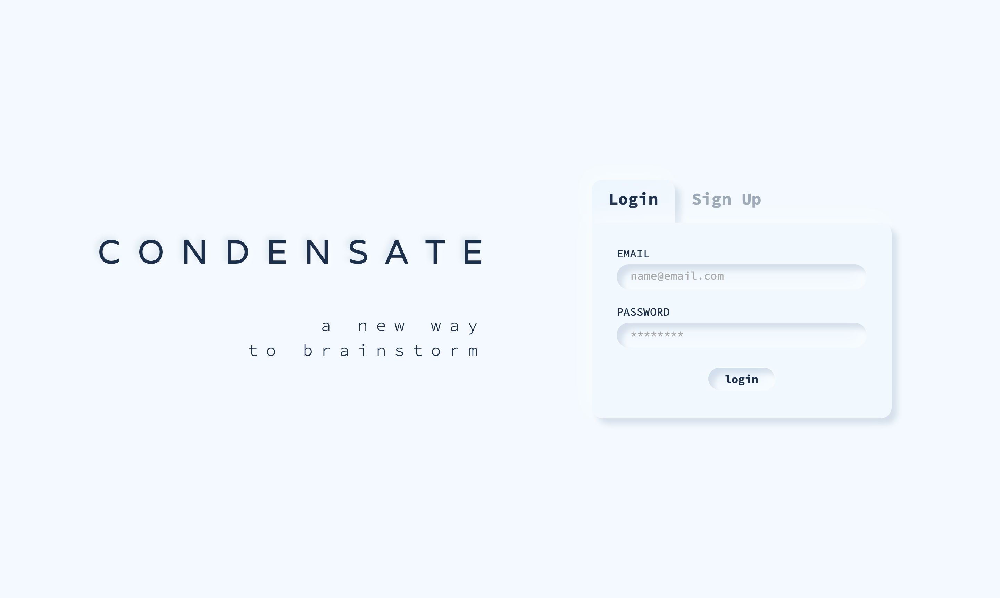

## Contributors

[Graham Thompson](https://github.com/grwthomps),
[James Miller](https://github.com/JamesRexMiller4),
[Raisa Primerova](https://github.com/RayRedGoose),
[Ryan Hantak](https://github.com/rhantak)

## Overview

Condensate is a new way to brainstorm. Inspired by the book ***Originals***, by Adam Grant this web application seeks to reimagine how people and businesses go about brainstorming, backed by the latest research studies. 

## Table of Contents 
  * [Getting Started / Setup](#setup)
  * [Deployment](#deployment)
  * [Workflow](#workflow)
    + [SignUp/Login](#signup)
    + [Dashboard](#dashboard)
    + [ROUND 1](#round-1)
    + [ROUND 2](#round-2)
    + [ROUND 3](#round-3)
  * [Tech Stack](#tech-stack)
  * [Screenshots](#screenshots)
  * [Style Guide](#style-guide)

## Setup

If you wish to have a local version of this application on your machine, run the following commands in a new directory.

- `git clone https://github.com/CondensateCrew/Condensate.git`
- `npm i`
- `npm start` - to start the application on a local server
- `npm test` - to run the test suite 

***Coming Soon: Electron Desktop Application ***

## Deployment 

If you would like to see a working version of this application click on the link below.

[Link to Heroku](https://condensate-app.herokuapp.com/)

## Workflow

### SignUp 

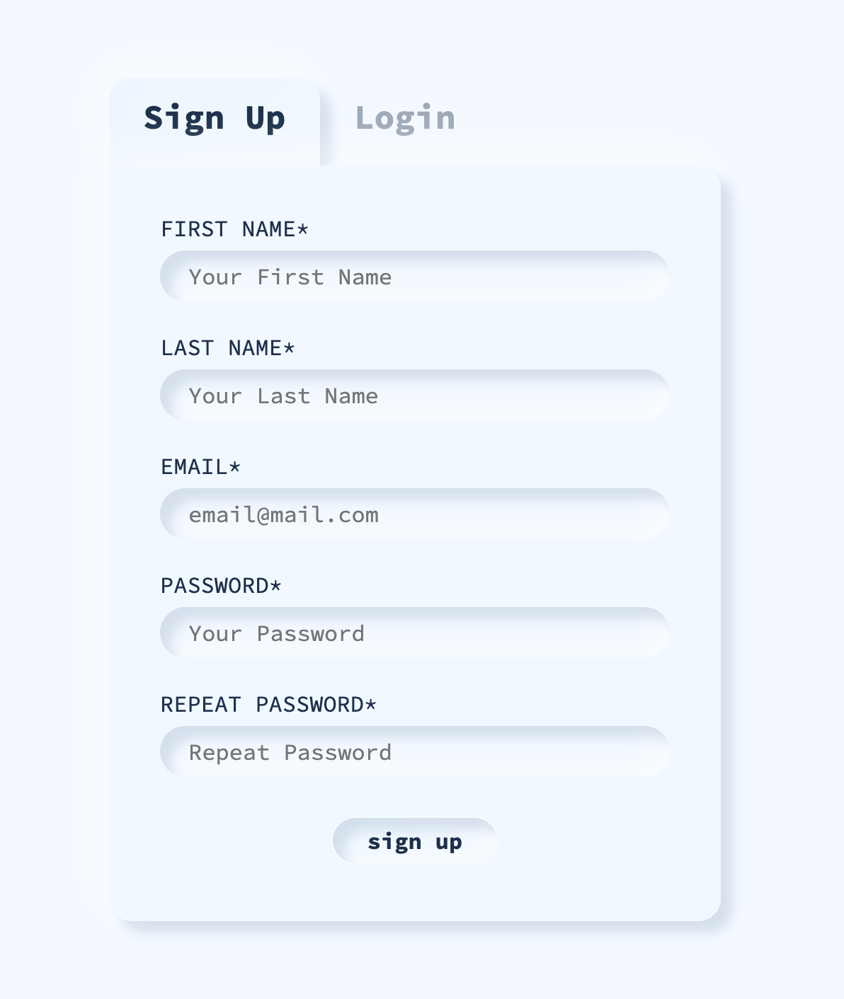

When a visitor first opens the application they will land on the welcome page. If it is the first time using the application you will need to sign up. All sign up credentials are required and a visitor will not be able to proceed until they have provided their: 

**First Name**

**Last Name**

**Email Address**

**Password**

The visitor will need to provide their password twice to ensure that they are matching and have been entered correctly. Once all form fields have been entered the sign up button will become enabled. The user's password is hashed and their hashed version is what is stored in the database. We encourage you to choose a password that is easy to remember but not related to other accounts, in the interest of security. 

### Dashboard 

Visitors once signed up or logged in are presented with their dashboard, and are able to create a new brainstorm. 

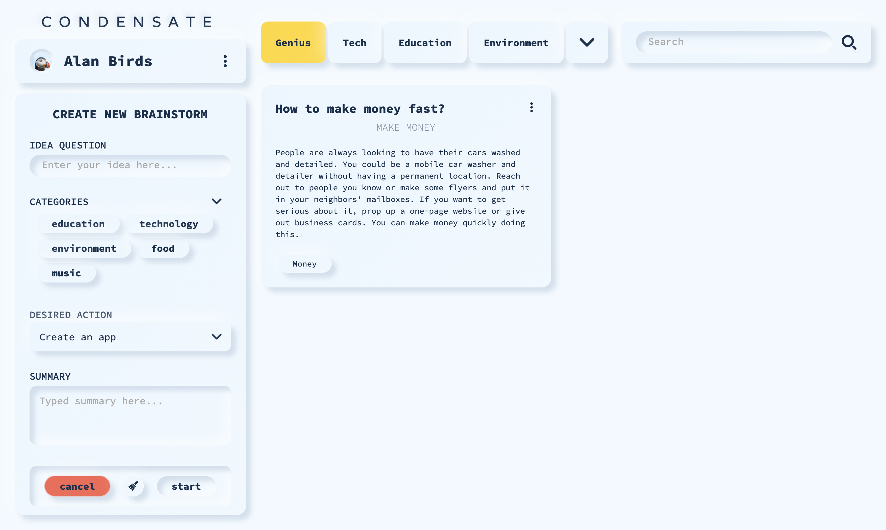

#### Create a New Brainstorm

After coming up with a question they seek to answer with their new brainstorm idea, they can select categories that the idea pertains too, as well as a basic action. Default categories and actions are provided to help streamline the ideation process, while mitigating any cognitive expense prior to the beginning of the brainstorm session. Once the form is filled out, a summary generates, and they can proceed to enter a new session.

### ROUND 1

The first round of the brainstorm session begins with an abstract, free-form word association. Users will select words that they feel compelled to click on, regardless of the association to their brainstorm question. 

After selecting 9 words, they will then be prompted to winnow their selection down to three words, whereupon they will begin the second round. 

### ROUND 2

In the second round, they will be provided an example sentence from one of the three words that they have selected. The objective in this round is to come up with as many questions pertaining to the example sentence as they can think of. This logic comes from a Harvard Business Review study where a group of participants were asked to brainstorm by asking questions, reported feeling more satisfied and energized rather than trying to come up with new ideas on the spot.

(Source: https://hbr.org/2018/03/better-brainstorming)

### ROUND 3 

After completing three rounds of question generation the user will begin the third round. In the third and final round, the user returns to their original question from when they filled out the form. On the right hand side, they have the option to incorporate a random word. 

This logic stems from a part of Adam Grant's book ***Originals***, which cited a research study where participants had been tasked with coming up with a new idea given some stimulus. In the study the first stimulus was to create an app based on a notebook, which resulted in ideas that were useful but not very original. When given a stimulus that was not directly related to the tasked assignment, the resulting ideas were deemed more original.

Beneath the random word generator they are able to review the questions they provided during Round 2, in case the way they thought about the example sentence triggers a new way of thinking about their original question. 

Once they have filled out the text area they are able to submit and will be returned to the dashboard, where the recently completed idea will now exist for the user to review and edit. 
 

## Tech Stack

**Front-end**

- TypeScript
- React
- Redux
- Jest/Enzyme
- ESLint

[**Back-end**](https://github.com/CondensateCrew/condensate_backend)

- Python
- Flask
- PostgreSQL
- SQLAlchemy
- Pytest

Integration with TravisCI
Deployment with Heroku

## Screenshots

**Welcome Page**

**Filled Login Form**

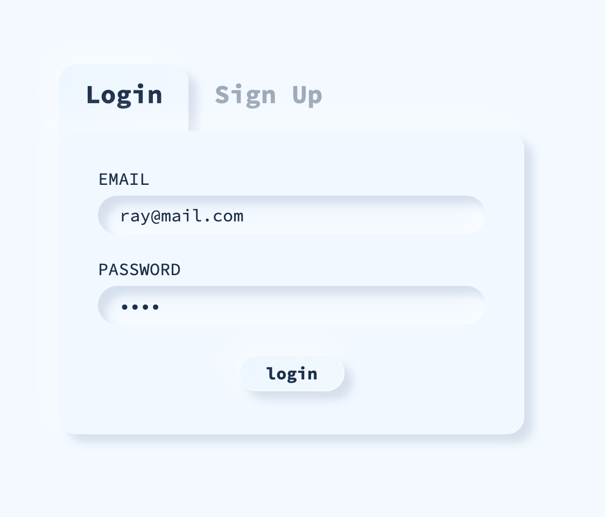

**Login Form with error**

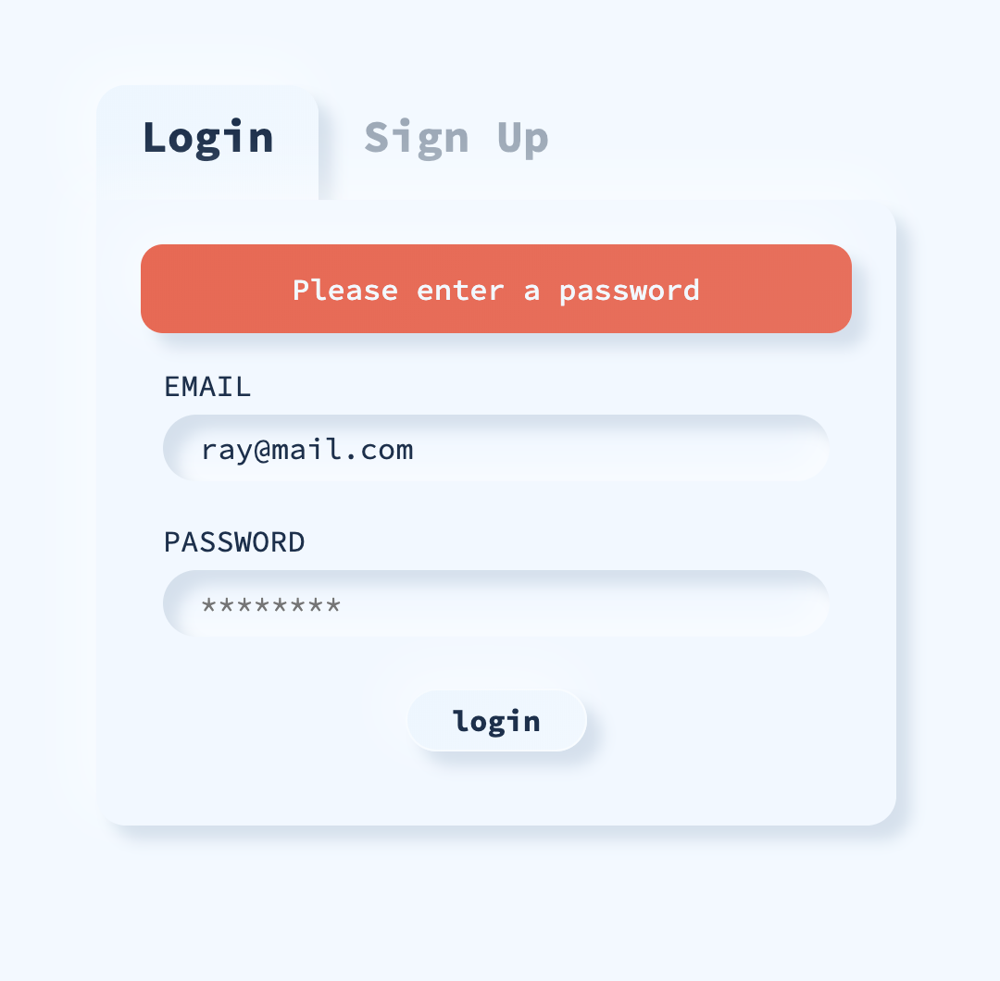

**SignUp Form**

**Dashboard**

**User Profile**

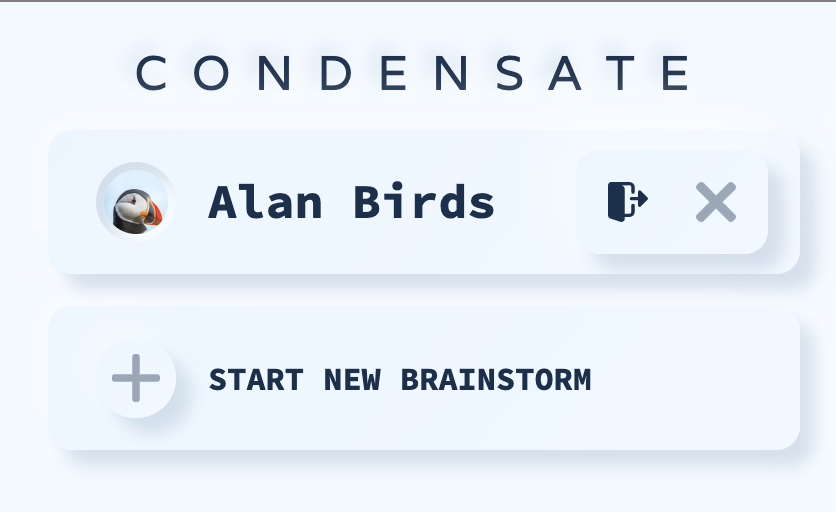

**Brainstorm Card**

**Round One Stage One**

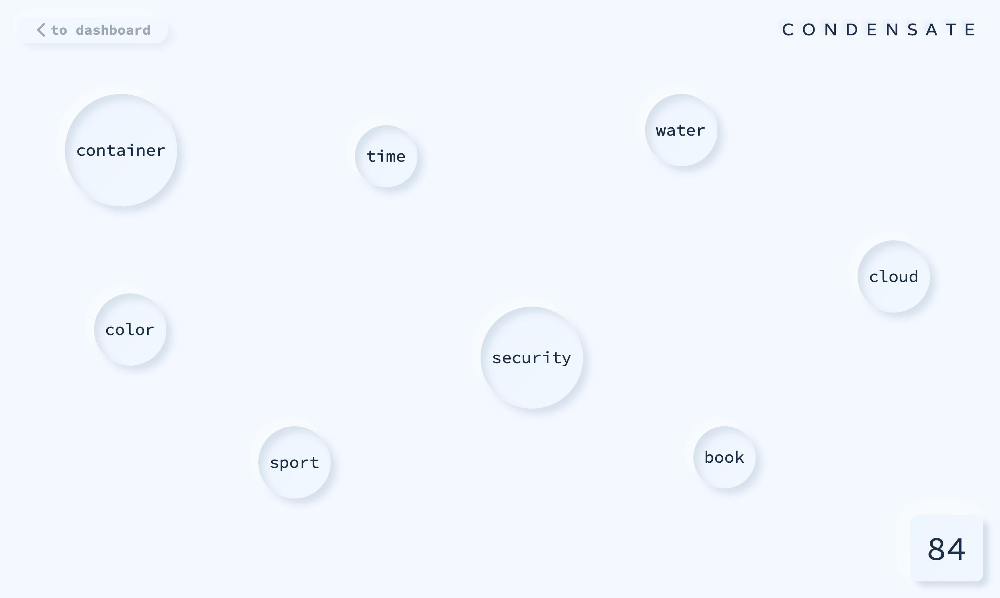

**Round One Stage Two**

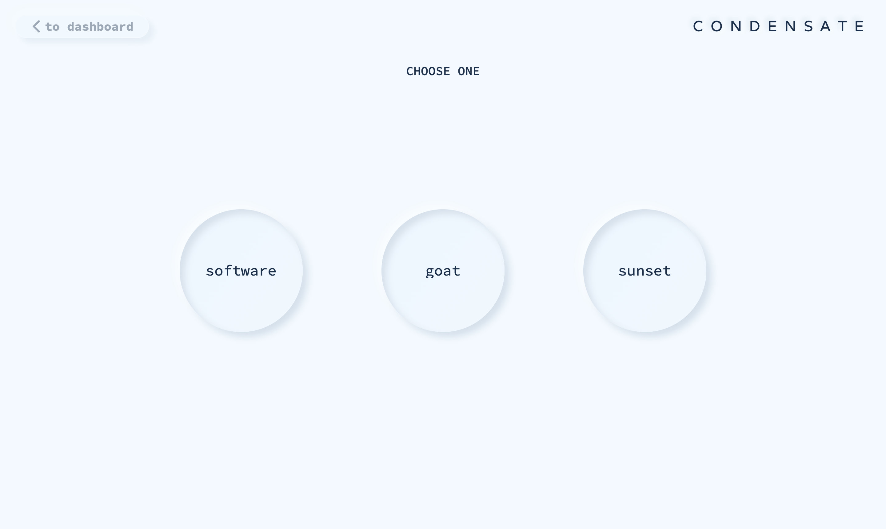

**Round Two**

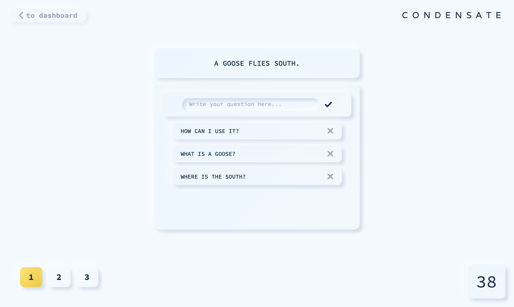

**Round Three**

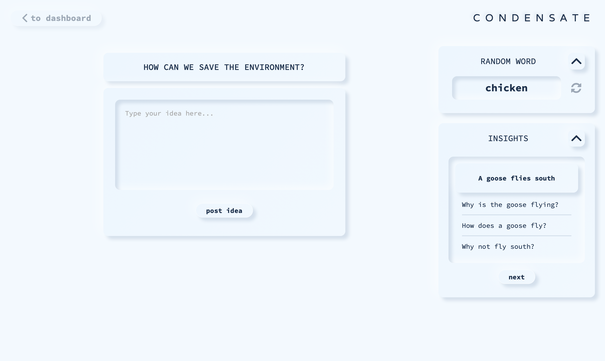

## Style Guide

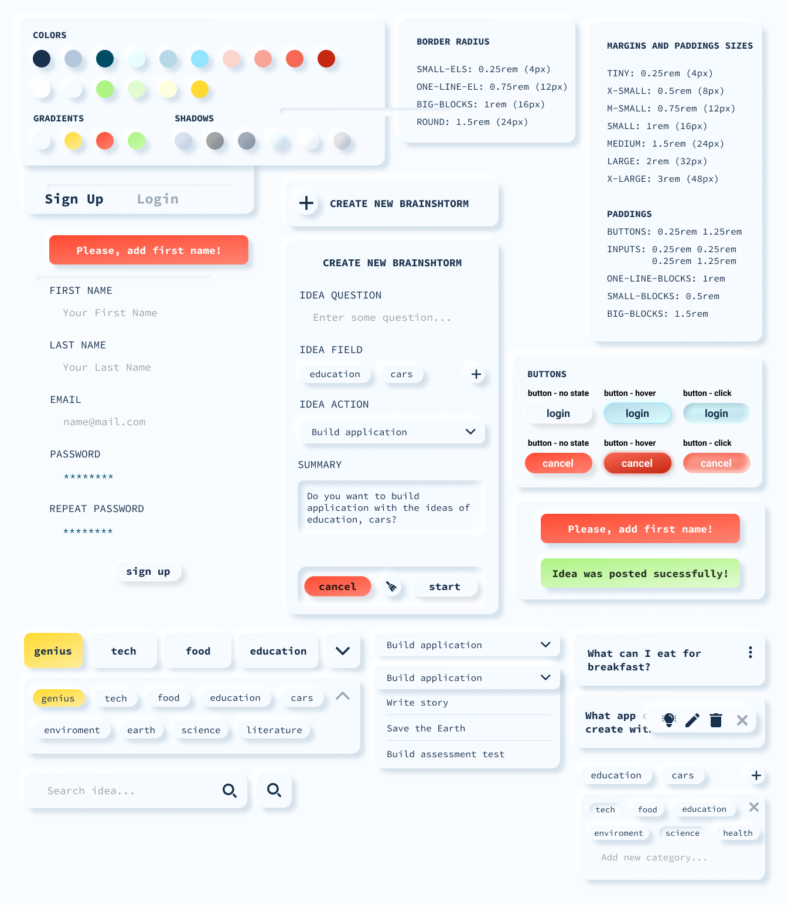
