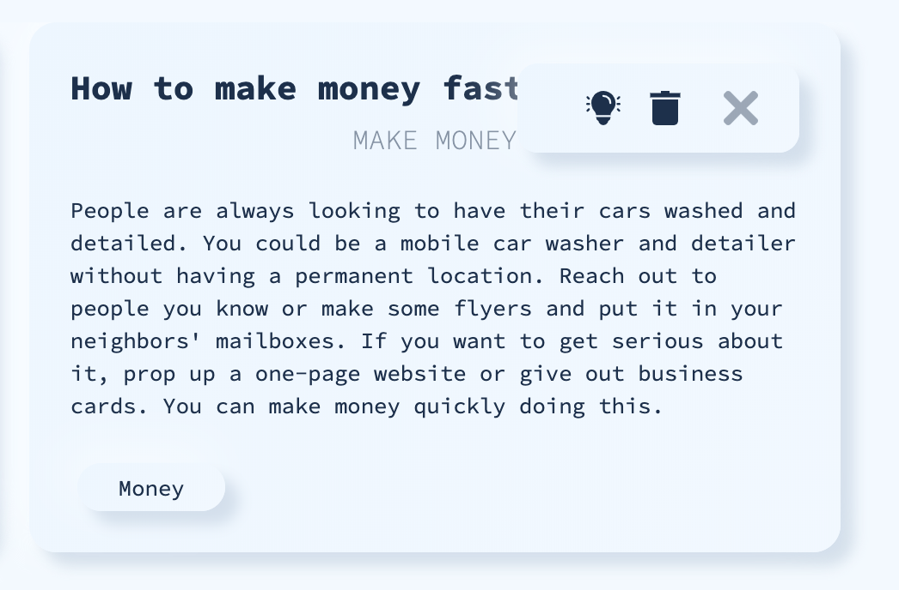

# Condensate

## Authors

[Graham Thompson](https://github.com/grwthomps)

[James Miller](https://github.com/JamesRexMiller4)

[Raisa Primerova](https://github.com/RayRedGoose)

[Ryan Hantak](https://github.com/rhantak)

## Overview

Condensate is a new way to brainstorm. Inspired by the book ***Originals***, by Adam Grant this web application seeks to reinterpret how people and businesses go about brainstorming, backed by the latest research studies. 

Visitors once signed up or logged in are presented with their dashboard, and are able to create a new brainstorm. 

After coming up with a question they seek to answer with their new brainstorm idea, they can select categories that the idea pertains too, as well as a basic action. Default categories and actions are provided to help streamline the ideation process, while mitigating any cognitive expense prior to the beginning of the brainstorm session. Once the form is filled out, a summary generates, and they can proceed to enter a new session.

### ROUND 1

The first round of the brainstorm session begins with an abstract, free-form word association. Users will select words that they feel compelled to click on, regardless of the association to their brainstorm question. 

After selecting 9 words, they will then be prompted to winnow their selection down to three words, whereupon they will begin the second round. 

### ROUND 2

In the second round, they will be provided an example sentence from one of the three words that they have selected. The objective in this round is to come up with as many questions pertaining to the example sentence as they can think of. This logic comes from a Harvard Business Review study where a group of participants were asked to brainstorm by asking questions, reported feeling more satisfied and energized rather than trying to come up with new ideas on the spot.

(Source: https://hbr.org/2018/03/better-brainstorming)

### ROUND 3 

After completing three rounds of question generation the user will begin the third round. In the third and final round, the user returns to their original question from when they filled out the form. On the right hand side, they have the option to incorporate a random word. This logic stems from a part of Adam Grant's book ***Originals***, which cited a research study where participants had been tasked with coming up with a new idea given some stimulus. In the study the first stimulus was to create an app based on a notebook, which resulted in ideas that were useful but not very original. When given a stimulus that was 
 

[Link to Heroku](https://condensate-app.herokuapp.com/)

## Tech Stack

**Front-end**

- TypeScript
- React
- Redux
- TDD with jest

[**Back-end**](https://github.com/CondensateCrew/condensate_backend)

- Python
- Flask
- PostgreSQL
- SQLAlchemy
- Pytest

Integration with TravisCI
Deployment with Heroku

## Setup

- `git clone https://github.com/CondensateCrew/condensate_backend.git`
- `npm i`
- `npm start` - for run app locally
- `npm test` - for run tests

## Screenshots

**Welcome Page**

**Filled Login Form**

**Login Form with error**

**SignUp Form**

**Dashboard**

**User Profile**

**Brainstorm Card**

**Round One Stage One**

**Round One Stage Two**

**Round Two**

**Round Three**

## Style Guide

